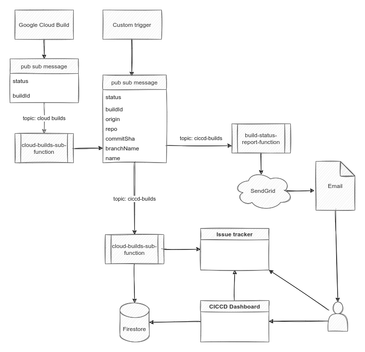

# CI Cloud CD (CICCD)

A tool to get an overiew of your different CI/CD workflows. Whether they run on some cloud platform or on premises.

## Features

- Send email notifications for failed / successful builds
- Update status in issue tracker for failed / successful builds
- Configurable build dashboard listing builds of any provider
- Git repo page showing commits related to your builds

## Flow



## CICCD Dashboard

The dashboard runs on nextjs and is deployed on Google App Engine.

See the [sample CICCD console](https://ciccd-console.ew.r.appspot.com/)

## Services (cloud run)

- [ciccd-service](packages/ciccd-service/README.md)

  required: handles CICCD pub sub messages to add build statuses to the dashboard database

- [forward-service](packages/forward-service/README.md)
  
  optional: converts 'cloud-builds' pub sub messages send by Google Cloud Build to CICCD messages

- [report-service](packages/ciccd-service/README.md)

  optional: sends build report emails when configured and adds commit status checks to github


## Setup

This section will describe the require actions to setup everything in a new GCP project.

## Instructions to create resources with terraform

### Requirements

- GCP Project with billing enabled
- A fork (recommended) or clone of this repo
- terraform installed
- gcloud sdk installed

### Authenticate and set gcp project

```sh
gcloud auth login
gcloud config set project YOUR-GCP_PROJECT
```

### Create a service account that will be used to create all required resources

The service account that will be used is: `terraform@PROJECT_ID.iam.gserviceaccount.com`,

You must create this service account manually and give it the following permissions:

- artifactregistry.repositories.create
- artifactregistry.repositories.delete
- artifactregistry.repositories.get
- iam.serviceAccounts.actAs
- resourcemanager.projects.get
- run.services.create
- run.services.get
- serviceusage.operations.get
- serviceusage.services.enable
- serviceusage.services.get
- serviceusage.services.list

Note: you must have permissions to impersonate this service account when running terraform locally.

### Add your a terraform variable file `terraform.tfvars` in the `./terraform` sub folder.


```
# Your gcp project in which you want to run ciccd console
project = "ciccd-console"

region = "europe-west1"
zone = "europe-west1-c"
location = "europe-west"

# List all gcp projects on which you want to subscribe for cloud-build pub sub messages
cloud_build_projects = [
    "ciccd-console",
    "scrum-poker-31315",
    "team-timesheets",
]

# build settings

# repo containing your ciccd source code
repo_name = "cloud-build-monitor"
repo_owner = "thdk"
# which branch patterns should trigger build + deploy
repo_branch_pattern = ".*"

# app settings

# Repos listed in the app should match the repo_regex pattern else they wont be shown
repo_regex = "^thdk"
```

### Let terraform create the required resources

```sh
cd terraform
terrafom init
terraform apply
```

### Trigger initial cloud builds

```sh
gcloud beta builds triggers run app-trigger-deploy --branch=main
gcloud beta builds triggers run ciccd-service-trigger-deploy --branch=main
gcloud beta builds triggers run forward-service-trigger-deploy --branch=main
```

Next builds will be automatically triggered by adding new commits to the main branch.

