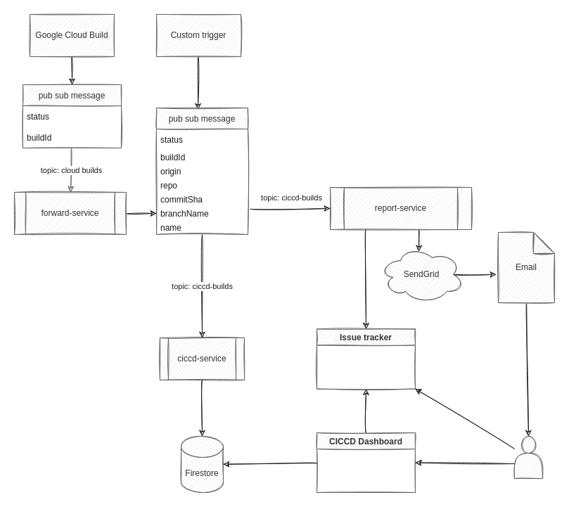

# CI Cloud CD (CICCD)

A tool to get an overview of your different CI/CD workflows. Whether they run on some cloud platform or on premises.

## Features

- Send email notifications for failed / successful builds
- Update status in issue tracker for failed / successful builds
- Configurable build dashboard listing builds of any provider
- Git repo page showing commits related to your builds

## Flow



## CICCD Dashboard

The dashboard runs on nextjs and is deployed on Google App Engine.

See the [sample CICCD console](https://ciccd-console.ew.r.appspot.com/)

## Services (cloud run)

- [ciccd-service](packages/ciccd-service/README.md)

  required: handles CICCD pub sub messages to add build statuses to the dashboard database

- [forward-service](packages/forward-service/README.md)
  
  optional: converts 'cloud-builds' pub sub messages send by Google Cloud Build to CICCD messages

- [report-service](packages/ciccd-service/README.md)

  optional: sends build report emails when configured and adds commit status checks to github


## Setup

This section will describe the require actions to setup everything in a new GCP project.

## Instructions to create resources with terraform

### Requirements

- A fork (recommended) or clone of this repo
- Install the following tools:
  - [terraform](https://learn.hashicorp.com/tutorials/terraform/install-cli#install-terraform)
  - [gcloud sdk](https://cloud.google.com/sdk/docs/install#installation_instructions)
  - [firebase CLI](https://firebase.google.com/docs/cli#install_the_firebase_cli)  
    Needed to deploy firestore security rules

### Create new GCP project

- create a new GCP project
- add a billing account
- connect your fork/clone of this github repository from the [cloud build repos page](https://console.cloud.google.com/cloud-build/repos) 
  - enable Cloud Build api if you didn't do it yet
  - click **Connect Repository**
  - authenticate with github and select the fork of this repo
  - no need to create a (sample) trigger

### Authenticate and set up GCP project

```sh
gcloud auth login
gcloud auth application-default login
gcloud config set project YOUR-GCP_PROJECT
```
### Create a service account that will be used to create all required resources

The service account that will be used is: `terraform@PROJECT_ID.iam.gserviceaccount.com`,

```sh
gcloud iam service-accounts create terraform
```

You must create this service account manually and give it the following permissions:
| Role name | Role           |
| ----------| -----          |
| App Engine Admin | roles/appengine.appAdmin |
| Artifact Registry Administrator | roles/artifactregistry.admin1 |
| Cloud Build Editor | roles/cloudbuild.builds.editor |
| Cloud Run Admin | roles/run.admin |
| Project IAM Admin | roles/resourcemanager.projectIamAdmin |
| Pub/Sub Admin | roles/pubsub.admin  |
| Secret Manager Admin | roles/secretmanager.admin |
| Storage Admin | roles/storage.admin |
| Firebase Admin | roles/firebase.admin |
| Service Usage Admin | roles/serviceusage.serviceUsageAdmin |

```sh
gcloud projects add-iam-policy-binding YOUR_GCP_PROJECT \
    --member="serviceAccount:terraform@YOUR_GCP_PROJECT.iam.gserviceaccount.com" \
    --role="roles/serviceusage.serviceUsageAdmin"
```

### Make sure you have the Service Account Token Creator role

The user, group or service account which will invoke the terraform commands will need the Service Account Token Creator role. Either on project level or on service account level.

```sh
# Allow users in the dev ops group to create access token for the terraform service account
gcloud iam service-accounts add-iam-policy-binding \
  terraform@[GCP-PROJECT].iam.gserviceaccount.com \
  --member='group:dev-ops@example.com' \
  --role='roles/iam.serviceAccountTokenCreator'

```

### Create a bucket to store terraform state

```sh
# example: gsutil mb -c standard -l europe-west1 gs://ciccd-console-terraform-state
gsutil mb -c <storage-class> -l <region> gs://<bucket-name>

# example: gsutil versioning set on gs://ciccd-console-terraform-state
gsutil versioning set on gs://<bucket-name>
```

### Create terraform backend config file

in `./terraform` add a file `config.gcs.tfbackend` with content:

```
bucket = "YOUR_GCP_BUCKET"
```

### Add a terraform variable file `terraform.tfvars` in the `./terraform` sub folder.

```sh
# Your gcp project in which you want to run ciccd console
project = "ciccd-console"

region = "europe-west1"
zone = "europe-west1-c"
location = "europe-west"

# List all gcp projects on which you want to subscribe for cloud-build pub sub messages
cloud_build_projects = [
    "ciccd-console",
    "scrum-poker-31315",
    "team-timesheets",
]

# build settings

# repo containing your ciccd source code (your fork / clone of this repo)
repo_name = "cloud-build-monitor"
repo_owner = "thdk"
# which branch patterns should trigger build + deploy
repo_branch_pattern = "main"

# app settings

# Repos listed in the app should match the repo_regex pattern else they wont be shown
repo_regex = "^thdk"

jira_host = "jira.domain.com"
issue_regex = "[A-Z][A-Z0-9]+-[0-9]+"
```

### Guarantee cloud-builds topics exist

Each project listed the `cloud_builds_project` variable should have a `cloud-builds` pub sub topic.
If it does not exist yet, you must manually create it.

```sh
# To create a topic `cloud-builds` for the current project:
gcloud pubsub topics create cloud-builds
```
### Let terraform create the required resources

```sh
cd terraform

# initialize terraform by running...
terraform init -backend-config=bucket=TERRAFORM_STATE_BUCKET 

# ...or use the config.gcs.tfbackend file
terraform init -backend-config=config.gcs.tfbackend

terraform plan

terraform apply
```
### Deploy firestore security rules

Unfortunately, you cannot [yet](https://github.com/hashicorp/terraform-provider-google/issues/8263) setup firebase rules in terraform.
Therefore you must manually deploy the firestore rules.

- install firebase tools
- `cd packages/app`
- `firebase login`
- `firebase use YOUR_PROJECT_ID`
- `firebase deploy --only firestore:rules`

### Add values to the created secrets

The easiest way to do this is by adding new versions for the listed secrets using the secret manager in gcp console.

**github-token**

```
<GITHUB_ACCESS_TOKEN>
```


**jira-user**

```
<JIRA_USER_NAME>
```


**jira-password**

```
<JIRA_PASSWORD>
```

**firebase-env**

You can find the values in the firebase console or by running:

```sh
# ./packages/app
firebase apps:sdkconfig
```
```
NEXT_PUBLIC_FIREBASE_API_KEY=<FIREBASE_API_KEY>
NEXT_PUBLIC_FIREBASE_AUTH_DOMAIN=<FIREBASE_AUTH_DOMAIN>
NEXT_PUBLIC_FIREBASE_PROJECT_ID=<FIREBASE_PROJECT_ID>
NEXT_PUBLIC_FIREBASE_STORAGE_BUCKET=<FIREBASE_STORAGE_BUCKET>
NEXT_PUBLIC_FIREBASE_MESSAGING_SENDER_ID=<FIREBASE_MESSAGE_NDER_ID>
NEXT_PUBLIC_FIREBASE_APP_ID=<FIREBASE_APP_ID>
```


### Trigger initial cloud builds

```sh
gcloud beta builds triggers run app-trigger-deploy --branch=main
gcloud beta builds triggers run ciccd-service-trigger-deploy --branch=main
gcloud beta builds triggers run forward-service-trigger-deploy --branch=main
```

Next builds will be automatically triggered by adding new commits to the main branch.

Visit your [cloud builds page](https://console.cloud.google.com/cloud-build/builds) to see your build progress.