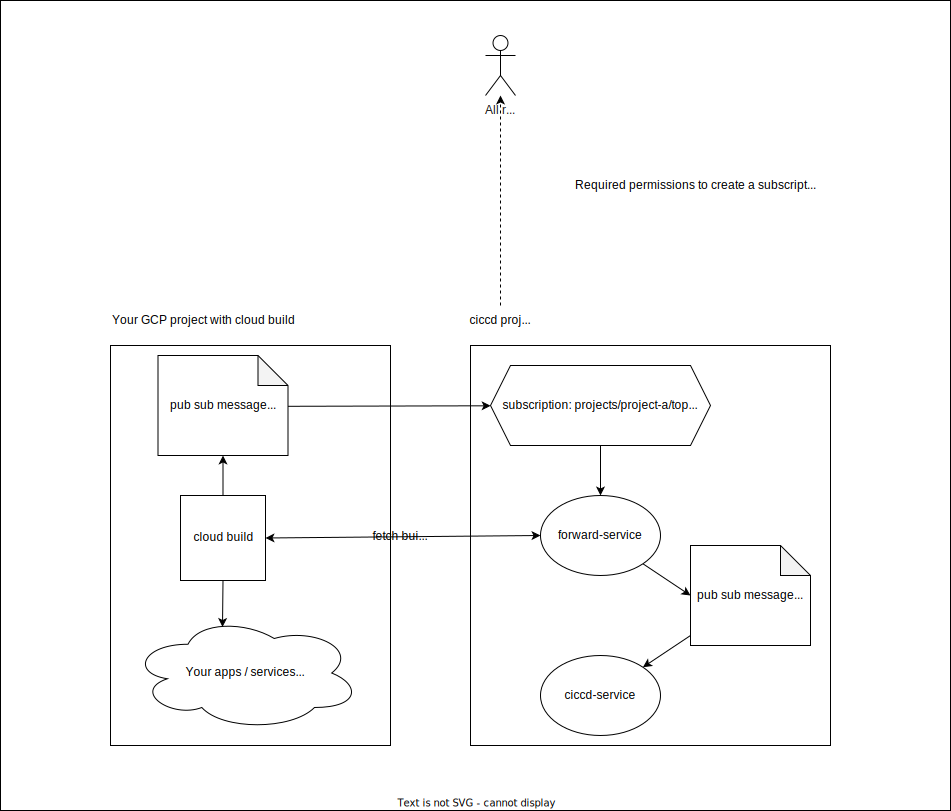

# Setup infrastructure using terraform (Infrastructure as code)

### Requirements

- A fork (recommended) or clone of this repo
- Install the following tools:
  - [terraform](https://learn.hashicorp.com/tutorials/terraform/install-cli#install-terraform)
  - [gcloud sdk](https://cloud.google.com/sdk/docs/install#installation_instructions)
  - [firebase CLI](https://firebase.google.com/docs/cli#install_the_firebase_cli)  
    Needed to deploy firestore security rules

### Create new GCP project

- create a new GCP project (referred in the manual as CICCD_GCP_PROJECT)
- add a billing account
- connect your fork/clone of this github repository from the [cloud build repos page](https://console.cloud.google.com/cloud-build/repos) 
  - enable Cloud Build api if you didn't do it yet
  - click **Connect Repository**
  - authenticate with github and select the fork of this repo
  - no need to create a (sample) trigger

### Authenticate and set up GCP project

```sh
gcloud auth login
gcloud auth application-default login
gcloud config set project CICCD_GCP_PROJECT
```
### Create a service account that will be used to create all required resources

The service account that will be used is: `terraform@CICCD_GCP_PROJECT.iam.gserviceaccount.com`,

```sh
gcloud iam service-accounts create terraform
```

You must create this service account manually and give it the following permissions:
| Role name | Role           | Reason |
| ----------| -----          | ---- |
| Browser | roles/browser | Read information about the current project. Ex. to get project number for given project.|
| App Engine Admin | roles/appengine.appAdmin |
| Artifact Registry Administrator | roles/artifactregistry.admin |
| Cloud Build Editor | roles/cloudbuild.builds.editor |
| Cloud Run Admin | roles/run.admin |
| Pub/Sub Admin | roles/pubsub.admin  |
| Secret Manager Admin | roles/secretmanager.admin |
| Storage Admin | roles/storage.admin |
| Firebase Admin | roles/firebase.admin |
| Service Account Creator | roles/iam.serviceAccountAdmin | Create, delete, update... service accounts |
| Project IAM Admin | roles/resourcemanager.projectIamAdmin | Bind iam roles to service accounts |
| Service Usage Admin | roles/serviceusage.serviceUsageAdmin |
| Service Account User | roles/iam.serviceAccountUser | Allow to 'act as' other service accounts |

```sh
gcloud projects add-iam-policy-binding CICCD_GCP_PROJECT \
    --member="serviceAccount:terraform@CICCD_GCP_PROJECT.iam.gserviceaccount.com" \
    --role="roles/serviceusage.serviceUsageAdmin"
```

### Create a bucket to store terraform state

```sh
# example: gsutil mb -c standard -l europe-west1 gs://ciccd-console-terraform-state
gsutil mb -c <storage-class> -l <region> gs://<bucket-name>

# example: gsutil versioning set on gs://ciccd-console-terraform-state
gsutil versioning set on gs://<bucket-name>
```

### Apply terraform resources

Whoever wants to apply terraform changes must have:
 - Service Account Token Creator role for the terraform@GCP_PROJECT.iam.gserviceaccount.com
 - Access to the terraform remote state bucket

#### Apply terraform resources using ci/cd pipelines (recommended)

Personally I am using the free plan of [env0](https://www.env0.com/) for IaC pipelines.

Create a service account that will be used by the cicd pipeline to trigger `terraform plan` and `terraform apply`:

```sh
gcloud iam service-accounts create terraform-cicd
```

Give the Service Account Token Creator role to the service account that is used by your pipeline:

```sh
# Allow the service account used by env0 to create access token for the terraform service account
gcloud iam service-accounts add-iam-policy-binding \
  terraform@[CICCD_GCP_PROJECT].iam.gserviceaccount.com \
  --member='serviceAccount:terraform-cicd@[CICCD_GCP_PROJECT].iam.gserviceaccount.com' \
  --role='roles/iam.serviceAccountTokenCreator'
```

Give the service account access to the gcp bucket containing terraform state:

```
gsutil iam ch serviceAccount:terraform-cicd@[CICCD_GCP_PROJECT].iam.gserviceaccount.com:roles/storage.admin gs://[GCP_STATE_BUCKET]
```


Note: if all is set up correctly, no human should ever have this role.

#### Apply terraform resources manually (room for human errors)


Give a user or group the Service Account Token Creator role. Either on project level or on service account level.

```sh
# Allow users in the dev ops group to create access token for the terraform service account
gcloud iam service-accounts add-iam-policy-binding \
  terraform@[CICCD_GCP_PROJECT].iam.gserviceaccount.com \
  --member='group:dev-ops@example.com' \
  --role='roles/iam.serviceAccountTokenCreator'

```


Give the user or group access to the gcp bucket containing terraform state:

```
gsutil iam ch group:dev-ops@example.com:roles/storage.admin gs://[GCP_STATE_BUCKET]
```

### Create terraform backend config file

in `./terraform` add a file `config.gcs.tfbackend` with content:

```
bucket = "YOUR_GCP_BUCKET"
```

### Add a terraform variable file `terraform.tfvars` in the `./terraform` sub folder.

```sh
# Your gcp project in which you want to run ciccd console
project = "ciccd-console"

region = "europe-west1"
zone = "europe-west1-c"
location = "europe-west"

# List all gcp projects on which you want to subscribe for cloud-build pub sub messages
cloud_build_projects = [
    "ciccd-console",
    "scrum-poker-31315",
    "team-timesheets",
]

# build settings

# repo containing your ciccd source code (your fork / clone of this repo)
repo_name = "cloud-build-monitor"
repo_owner = "thdk"
# which branch patterns should trigger build + deploy
repo_branch_pattern = "main"

# app settings

# List the specific users (user:name@example.com), groups (group:viewers@example.com) which are allowed access to your app. Use "allUsers" if you either want to allow public access or if you are using an external load balancer with IAP.
allowed_http_viewers = [ "allUsers"]

# Repos listed in the app should match the repo_regex pattern else they wont be shown
repo_regex = "^thdk"

jira_host = "jira.domain.com"
issue_regex = "[A-Z][A-Z0-9]+-[0-9]+"
```

### cloud_build_projects

This sections contains the requirements for each of the projects that you have listed in the `cloud_builds_projects` variable of your configuration file.

Alternatively, you can add the [terraform module from here](./../terraform/ciccd-external/README.md) to each of these projects instead of applying the requirements manually. 



#### Guarantee cloud-builds topics exist

Each project listed the `cloud_builds_project` variable should have a `cloud-builds` pub sub topic.
If it does not exist yet, you must manually create it.

```sh
# To create a topic `cloud-builds` for the current project:
gcloud pubsub topics create cloud-builds
```

#### Give the cloud build viewer role to the service account of the forward service

Give the `roles/cloudbuild.builds.viewer` to forward-service-runtime@CICCD_GCP_PROJECT.iam.gserviceaccount.com

#### Allow terraform to create pub sub subscription in your GCP project

Terraform will need to create a pub sub subscription on the *cloud-builds* topic for each of the projects listed in `cloud_builds_project` variable.

You should give the role `roles/pubsub.subscriber` on the topic `projects/CICCD_GCP_PROJECT/topics/cloud-builds` to `terraform@[GCP-PROJECT].iam.gserviceaccount.com`


### Let terraform create the required resources

```sh
cd terraform

# initialize terraform by running...
terraform init -backend-config=bucket=TERRAFORM_STATE_BUCKET 

# ...or use the config.gcs.tfbackend file
terraform init -backend-config=config.gcs.tfbackend

terraform plan

terraform apply
```

### Add values to the created secrets

The easiest way to do this is by adding new versions for the listed secrets using the secret manager in gcp console.

**github-token**

```
<GITHUB_ACCESS_TOKEN>
```


**jira-user**

```
<JIRA_USER_NAME>
```


**jira-password**

```
<JIRA_PASSWORD>
```

**firebase-env**

You can find the values in the firebase console or by running:

```sh
# ./packages/app
firebase apps:sdkconfig
```
```
NEXT_PUBLIC_FIREBASE_API_KEY=<FIREBASE_API_KEY>
NEXT_PUBLIC_FIREBASE_AUTH_DOMAIN=<FIREBASE_AUTH_DOMAIN>
NEXT_PUBLIC_FIREBASE_PROJECT_ID=<FIREBASE_PROJECT_ID>
NEXT_PUBLIC_FIREBASE_STORAGE_BUCKET=<FIREBASE_STORAGE_BUCKET>
NEXT_PUBLIC_FIREBASE_MESSAGING_SENDER_ID=<FIREBASE_MESSAGE_SENDER_ID>
NEXT_PUBLIC_FIREBASE_APP_ID=<FIREBASE_APP_ID>
```

### Allow forward-service service account to view cloud builds from your gcp projects

For each gcp project you wish to subscribe to cloud builds statuses, you must give the `Cloud Build Viewer` role to `forward-service-runtime@[GCP_PROJECT_ID].iam.gserviceaccount.com`.

Note that you must list each project in the `cloud_build_projects` property of your terraform config and run `terraform apply` if you haven't done this yet to setup the required pub sub resources.

### Trigger initial cloud builds

```sh
gcloud beta builds triggers run app-trigger-deploy --branch=main --region=europe-west1
gcloud beta builds triggers run ciccd-service-trigger-deploy --branch=main --region=europe-west1
gcloud beta builds triggers run forward-service-trigger-deploy --branch=main --region=europe-west1
```

Next builds will be automatically triggered by adding new commits to the main branch.

Visit your [cloud builds page](https://console.cloud.google.com/cloud-build/builds) to see your build progress.