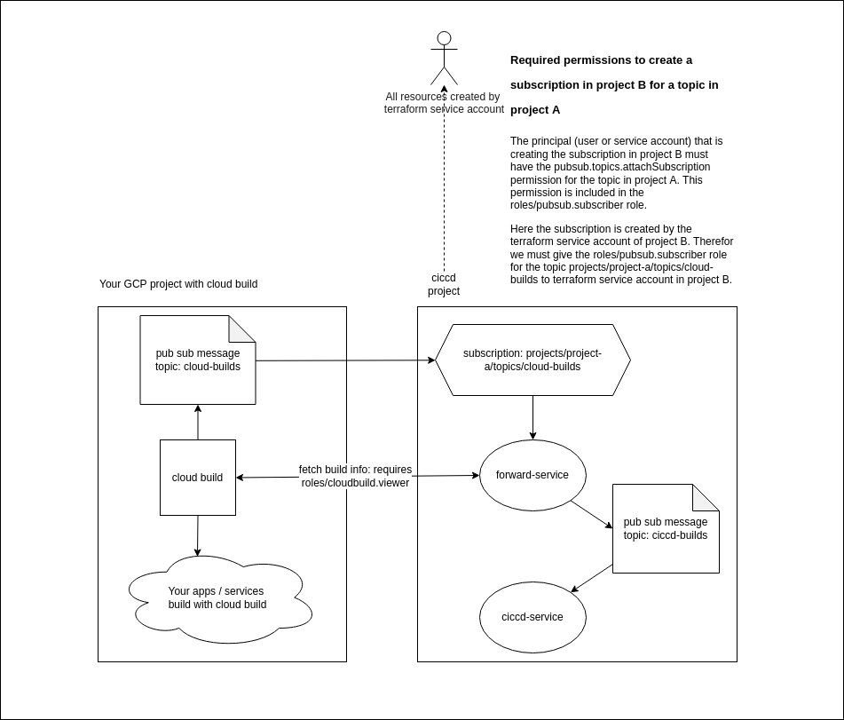

# ciccd-external terraform module

You can add this module to your GCP project to easily give the required permissions to service accounts from the ciccd project.

The ciccd project needs permissions in order to subscribe to your `cloud-builds` pubsub topic and have a build viewer role so it can fetch additional information for your cloud builds.

